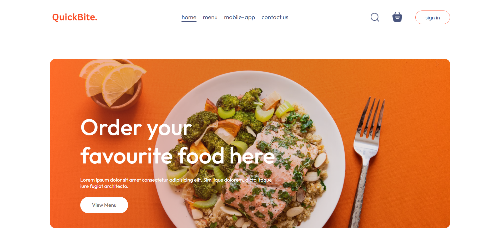
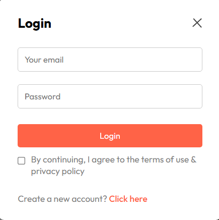
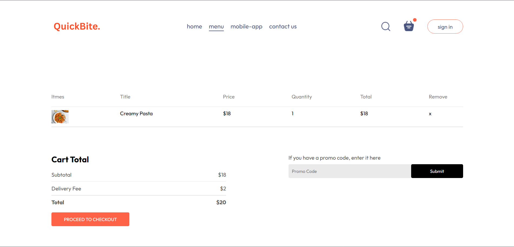

# 🍔 QuickBite — Food Ordering Web App (MERN Stack)

## 🚀 Overview

**QuickBite** is a full-stack food ordering web application built using the MERN stack. It provides a seamless experience for users to browse meals, place orders, and make secure payments, while offering an admin dashboard to manage products and orders efficiently.

---

## ✨ Key Features

### 👤 User Side

* 🔐 Secure authentication (JWT-based login/signup)
* 🍕 Browse and search food items
* 🛒 Add/remove items from cart
* 💳 Secure checkout with Stripe integration
* 📦 Order placement & tracking

### 🛠️ Admin Panel

* 📋 Manage food items (Add / Update / Delete)
* 📦 View and update order status
* 👥 Manage users (optional if implemented)

---

## 🧰 Tech Stack

| Layer    | Technology                          |
| -------- | ----------------------------------- |
| Frontend | React.js, Context API, React Router |
| Backend  | Node.js, Express.js                 |
| Database | MongoDB                             |
| Auth     | JWT (JSON Web Tokens)               |
| Payments | Stripe API                          |
| Styling  | CSS / Custom Styling                |

---

## 📁 Project Structure

```
QuickBite/
├── client/        # Frontend (React)
├── server/        # Backend (Node + Express)
├── admin/         # Admin Dashboard
├── .gitignore
└── README.md
```

---

## ⚙️ Installation & Setup

### 🔧 Prerequisites

* Node.js (v18+ recommended)
* MongoDB (local or cloud)

---

## 🖥️ Run Locally

### 1️⃣ Clone Repository

```bash
git clone https://github.com/your-username/QuickBite.git
cd QuickBite
```

---

### 2️⃣ Backend Setup

```bash
cd server
npm install
```

Create `.env` file:

```
PORT=5000
MONGO_URI=your_mongodb_connection
JWT_SECRET=your_secret_key
STRIPE_SECRET_KEY=your_stripe_key
```

Run backend:

```bash
cd backend
npm install
npm run server
```

---

### 3️⃣ Frontend Setup

```bash
cd frontend
npm install
npm run dev
```

---

### 4️⃣ Admin Panel Setup

```bash
cd admin
npm install
npm run dev
```

---

## 🌐 Usage

* User App → http://localhost:5173
* Admin Panel → http://localhost:5174

### Flow:

1. Register / Login
2. Browse food items
3. Add to cart
4. Place order
5. Pay using Stripe test card
6. Admin manages orders

---

## 💳 Stripe Test Card

Use this for testing payments:

```
Card Number: 4242 4242 4242 4242
Expiry: Any future date
CVV: Any 3 digits
```

---

## 📸 Screenshots

### 🏠 Home


### 🔐 Login


### 🛒 Cart


---

## 📡 API Overview

| Method | Endpoint    | Description           |
| ------ | ----------- | --------------------- |
| POST   | /api/auth   | Register/Login user   |
| GET    | /api/foods  | Get all food items    |
| POST   | /api/orders | Create new order      |
| GET    | /api/orders | Get user/admin orders |

---

## 🔒 Security Notes

* `.env` file is ignored for security
* JWT used for authentication
* Stripe handles secure payments

---

## 🤝 Contributing

Pull requests are welcome. For major changes, open an issue first to discuss what you would like to change.

---

## 👨‍💻 Author

**Muhammad Abbas**

---

## ⭐ Final Note

If you like this project, consider giving it a ⭐ on GitHub — it helps a lot!
